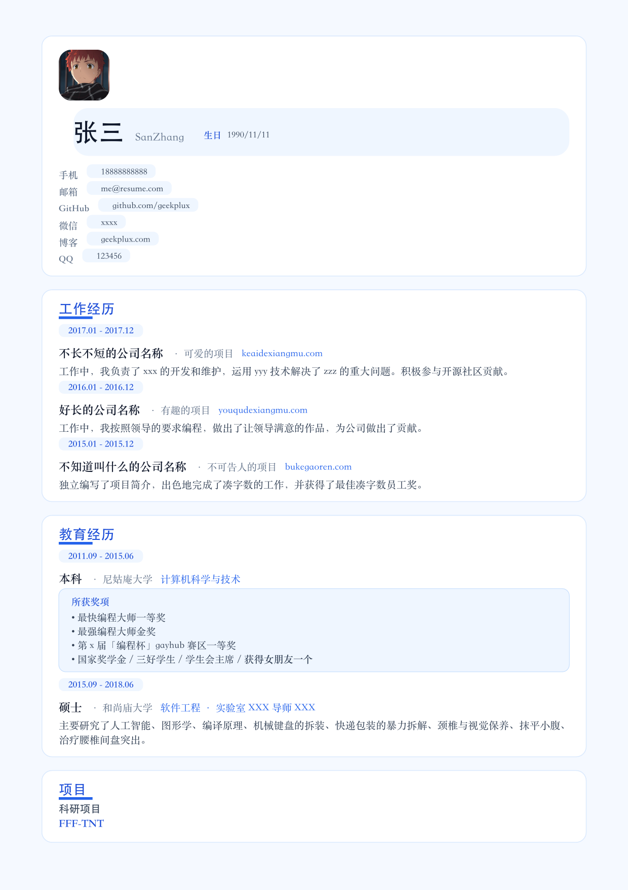

# cv_resume

> 一份开箱即用、专为 macOS 优化的中文 LaTeX 简历模板。

基于 [ModernCV](https://github.com/moderncv/moderncv) 深度定制，做了中文字体适配与排版打磨，用 **XeLaTeX** 编译，告别字体缺失与排版错位，让你专注内容本身。



## 为什么选它

- **macOS 原生字体，零配置开跑** —— 不再为「找不到 SimSun / SimHei」报错抓狂，全部改用系统自带的 `STSong / Songti SC / Heiti SC / Kaiti SC / STFangsong / PingFang SC`，装完 MacTeX 直接 `make`，PDF 秒出。
- **双编译消除 rerun 警告** —— Makefile 自动连跑两次 `xelatex`，hyperref 与交叉引用的警告一次性干掉，强迫症福音。
- **细节打磨到位** —— `\twoline` 辅助宏解决日期栏两行对齐、软连字符修复 Overfull hbox、奖项内嵌描述参数让左右栏等高对齐，每一处都经得起放大镜检视。
- **主题随心切换** —— 默认 `blue`，一行改成 `orange / red / green / grey / roman`，风格由你定。

## 本分支说明

基于上游 [geekplux/cv_resume](https://github.com/geekplux/cv_resume) 做了以下修改，**仅供 macOS 使用**。Windows / Linux 用户请使用上游原版。

1. **字体配置 macOS 化**：删除 `ifplatform`、`\ifwindows` 分支及对 Windows 字体的引用，统一改用 macOS 系统自带中文字体，开箱即用。
2. **Makefile 双编译**：默认连续运行两次 `xelatex`，构建前自动 `clean`。
3. **修复 Overfull \hbox**：在 `netjsongraph.js` 等长词中插入软连字符 `\-` 允许断词，视觉无影响。

## 特性

- 字体族按中文习惯命名快捷宏：`\song / \fs / \yh / \hei / \kai`
- 字号宏齐全：`\chuhao` ~ `\qihao`（初号到七号）
- 页面边距通过 `\usepackage[scale=0.9]{geometry}` 的 `scale` 调整
- 默认主题 `blue`，可在 `\moderncvtheme[blue]{classic}` 处切换

## 文件结构

```
cv_resume/
├── template_cn_blue.tex   # 模板主文件，编辑此文件即可
├── template_cn_blue.pdf   # 编译产物示例
├── template_cn_blue.png   # 预览图
├── avatar.png             # 简历头像，替换为自己的图片
├── Makefile               # 编译入口
├── LICENSE                # MIT 协议
└── README.md
```

## 环境要求

- macOS（仅在 macOS 上测试通过）
- 完整的 TeX 发行版，推荐 [MacTeX](http://www.tug.org/mactex/)（自带 `xelatex`、`moderncv`、`xeCJK`、`etoolbox`）
- 系统自带中文字体（macOS 默认全部预装）：
  - `STSong`、`Songti SC`
  - `Heiti SC`、`STHeiti`
  - `Kaiti SC`、`Kai`
  - `STFangsong`
  - `PingFang SC`

## 快速开始

### 1. 安装 MacTeX

```bash
brew install --cask mactex
```

或前往 [MacTeX 官网](http://www.tug.org/mactex/) 下载 `.pkg` 安装包。

> MacTeX 体积较大（约 5 GB+）。轻量方案可装 [BasicTeX](http://www.tug.org/mactex/morepackages.html) 后用 `tlmgr install moderncv xecjk etoolbox` 单独安装所需宏包。

### 2. 编译

```bash
make
```

`Makefile` 内部连续调用两次 `xelatex`，编译成功后在当前目录生成 `template_cn_blue.pdf`。

### 3. 清理中间产物

```bash
make clean
```

删除 `.aux / .log / .out / .pdf` 等临时文件。

### 4. 自定义内容

直接编辑 `template_cn_blue.tex`：

- **个人信息**：文件顶部 `\firstname / \familyname / \mobile / \email / \photo` 等命令
- **章节内容**：`\begin{document}` 之后的 `\section{...}` 块
- **头像**：替换根目录下的 `avatar.png`，保持文件名不变（或修改 `\photo[64pt]{avatar.png}`）

## Troubleshooting

### `Font ... not found`

确认本机是否装了对应字体：

```bash
fc-list :lang=zh-cn | grep -iE "(STSong|Songti SC|Heiti SC|Kaiti SC|STFangsong|PingFang SC)"
```

若某个字体缺失，可在 `template_cn_blue.tex` 顶部替换为同类其他 macOS 字体。

### `! LaTeX Error: File 'moderncv.cls' not found`

TeX 发行版没装 moderncv 宏包。BasicTeX 用户需手动安装：

```bash
sudo tlmgr install moderncv xecjk etoolbox ifplatform fontspec
```

### `Overfull \hbox` 警告

通常是某个英文长词（URL、项目名）放不下。在词中插入软连字符 `\-` 允许断词，例如 `netjsongraph\-.js`。

### 中文标点显示不正常

确认源文件保存为 **UTF-8** 编码，并且用 `xelatex` 而非 `pdflatex` 编译。

## 上游与致谢

- 原始模板：[geekplux/cv\_resume](https://github.com/geekplux/cv_resume)
- 底层模板：[ModernCV](https://github.com/moderncv/moderncv) by Xavier Danaux

## LICENSE

**cv_resume** © [geekplux](https://github.com/geekplux)，本分支继承上游的 [MIT](./LICENSE) 许可证。
